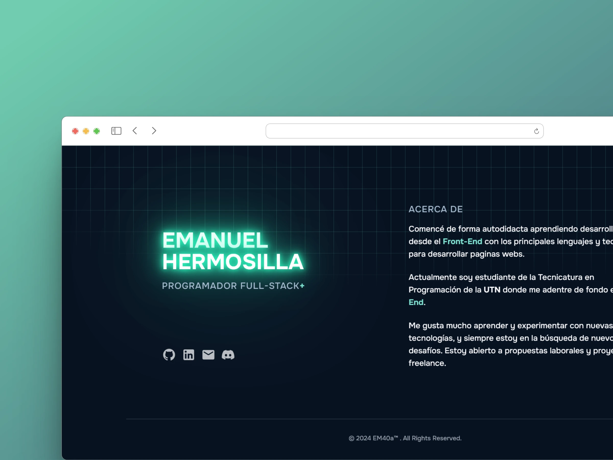

# Portafolio

Este es mi portafolio personal, donde muestro mis proyectos y habilidades.



Fue creado con [Astro](https://astro.build/), un nuevo marco de trabajo para construir sitios web modernos.

También utilice [Tailwind CSS](https://tailwindcss.com/), un marco de trabajo CSS de utilidad de baja capa que le brinda todas las herramientas que necesita para construir componentes personalizados sin CSS.

## 🚀 Estructura del Proyecto

Dentro del proyecto, encontraras la siguiente estructura de archivos y directorios:

```text
/
├── public/
│   └── favicon.svg
├── src/
│   ├── components/
│   │   └── Component.astro
│   ├── layouts/
│   │   └── Layout.astro
│   └── pages/
│       └── index.astro
└── package.json
```

Astro busca archivos `.astro` o `.md` en el directorio `src/pages/`. Cada página se expone como una ruta basada en su nombre de archivo.

No hay nada especial en `src/components/`, pero es donde nos gusta poner cualquier componente **Astro/React/Vue/Svelte/Preact**.

Cualquier archivo estático, como imágenes, puede colocarse en el directorio `public/`.

# Get Started


```bash
pnpm dev # npm run dev - yarn dev
```

### 📚 Recursos

- [Documentación de Astro](https://docs.astro.build/)
- [Tailwind CSS](https://tailwindcss.com/)
- [Esquema del JSON](https://jsonresume.org/schema/) 
- [Repositorio AstroIcons](https://github.com/natemoo-re/astro-icon)
- [Repositorio Svgl](https://github.com/pheralb/svgl)

---

Recuerda que puedes ver el proyecto en 👉 [https://EM40A.vercel.app](https://em40a-resume.vercel.app/)
